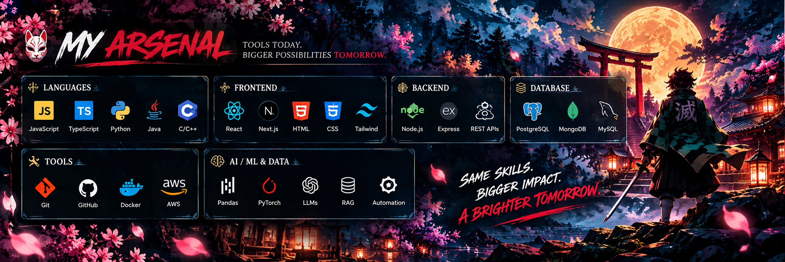
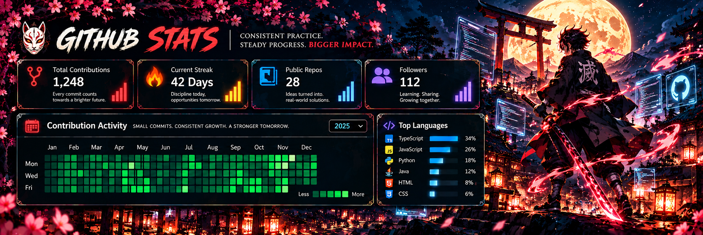
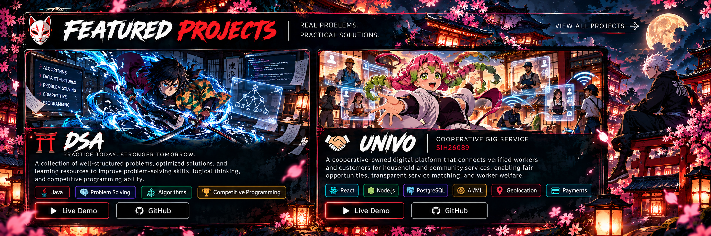
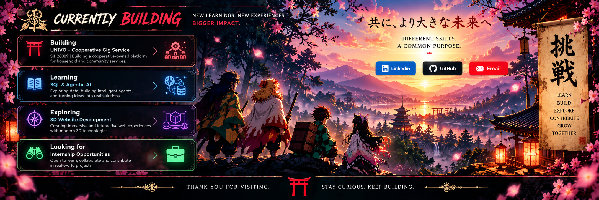

  <a href="#about"><kbd>&nbsp;ABOUT&nbsp;</kbd></a>&nbsp;&nbsp;•&nbsp;&nbsp;
  <a href="#skills"><kbd>&nbsp;SKILLS&nbsp;</kbd></a>&nbsp;&nbsp;•&nbsp;&nbsp;
  <a href="#journey"><kbd>&nbsp;JOURNEY&nbsp;</kbd></a>&nbsp;&nbsp;•&nbsp;&nbsp;
  <a href="#stats"><kbd>&nbsp;STATS&nbsp;</kbd></a>&nbsp;&nbsp;•&nbsp;&nbsp;
  <a href="#projects"><kbd>&nbsp;PROJECTS&nbsp;</kbd></a>&nbsp;&nbsp;•&nbsp;&nbsp;
  <a href="#building"><kbd>&nbsp;BUILDING&nbsp;</kbd></a>&nbsp;&nbsp;•&nbsp;&nbsp;
  <a href="#contact"><kbd>&nbsp;CONTACT&nbsp;</kbd></a>

 

&nbsp;

  

 

